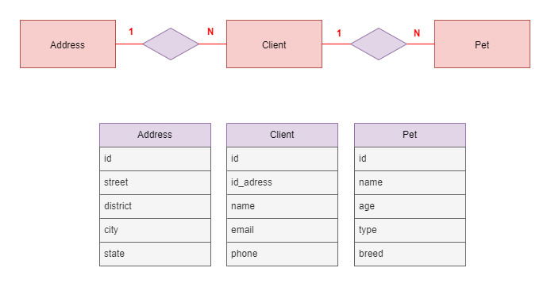

# API em C# MVC com Entity Framework com acesso a um banco de dados SQL Server

Esta é uma API criada em C# utilizando o padrão MVC e o framework de mapeamento objeto-relacional Entity Framework. Aqui, apresentamos todas as informações importantes sobre a API.

Esta API tem o objetivo de ser apenas um serviço de armazenamento e obtenção de dados utilizando HTTP e JSON. Para isso, optei por fazer um simples sistema de gerenciamento de um Pet Shop.

## Visão geral

Esta API foi criada com o objetivo de fornecer um serviço que permita a consulta e manipulação de dados de uma aplicação. Foi utilizado o Entity Framework para realizar a comunicação com o banco de dados.

## Funcionalidades

* Consulta de dados de um banco de dados relacional
* Inserção de novos dados no banco de dados

## Tecnologias utilizadas

* C#
* ASP.NET MVC
* Entity Framework
* SQL Server
* Azure

## Instalação

1. Clone este repositório em seu computador
2. Abra o projeto no Microsoft Visual Studio Code
3. Execute a aplicação dando o comando '*dotnet run*' em seu terminal.

## Testes

1. Com a API em execução, verá que abriu um link em seu navegador com o localhost.
2. Neste link adicione: /swagger
3. Você verá a documentação criada pelo swagger e poderá fazer seus testes!

## Modelagem Relacional

## Endpoints

* GET api/clients- Retorna uma lista dos clientes.
* GET api/client/{id} - Retorna o cliente com o ID especificado.
* POST api/client - Cadastra um novo cliente.
* GET api/address - Retorna uma lista dos endereços.
* GET api/address/{id} - Retorna o endereço com o ID especificado.
* POST api/address- Cadastra um novo endereço.
* GET api/pets- Retorna uma lista dos pets.
* GET api/pet/{id} - Retorna o pet com o ID especificado.
* POST api/pet- Cadastra um novo pet.

## Agradeço pela atenção!
